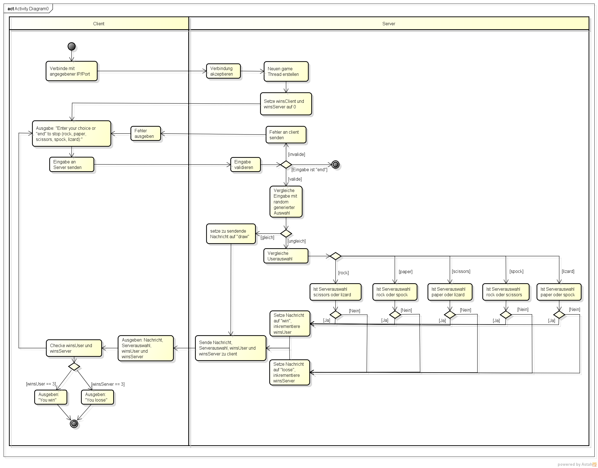

# PiPaPo

A very simple rock paper scissors implementation in Java with networking support.
Implements the 5 element variant with spock and lizard.

## Usage
Create the container using `docker compose up -d --build`.

After creating the container, you can play individual games in the container by running
`docker compose exec pipapo java -jar pipapo.jar client localhost 12345`.

## Execution flow

